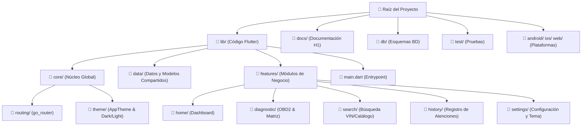

# Arquitectura del Proyecto y Guía Estructural de Carpetas
## Proyecto: Repuestos Exactos (AutoScan) — Hito 1

> **Propuesta de Valor**:  
> *"Para mecánicos de talleres automotrices que sufren de falta de información al cotizar repuestos, Repuestos Exactos interpreta el diagnóstico OBD2 y entrega una matriz comparativa instantánea basada en coste, durabilidad y riesgos, optimizando el tiempo y la decisión de compra."*

---

## 1. Visión General: ¿Por qué el proyecto está organizado así?

Este proyecto sigue una arquitectura **Feature-First combinada con principios de Clean Architecture (Arquitectura Limpia)**. 

### ¿Qué significa esto y por qué se eligió?
En el desarrollo de software moderno con Flutter existen dos formas clásicas de organizar el código:
1. **Layer-First (por capas):** Poner todas las pantallas juntas en una carpeta gigante `screens/`, todos los controladores en `controllers/`, etc. *(Tiende a volverse caótico cuando la app crece)*.
2. **Feature-First (por funcionalidad - Nuestra elección):** Agrupar el código según la funcionalidad del negocio automotriz (`diagnostic`, `history`, `search`, etc.). Cada funcionalidad encapsula su propia vista (`presentation/`) y su lógica.

### Ventajas de este enfoque:
- **Alta Cohesión y Bajo Acoplamiento:** Si necesitamos modificar la pantalla de diagnóstico OBD-II, solo tocamos la carpeta `features/diagnostic/` sin riesgo de romper el historial o la configuración.
- **Escalabilidad para el Hito 2:** Cuando en el siguiente hito conectemos la API REST y el escáner Bluetooth físico, cada feature simplemente incorporará su subcapa de datos (`data/` o `domain/`) sin reestructurar el proyecto.
- **Trabajo Colaborativo sin Conflictos:** Permite que 4 desarrolladores trabajen en paralelo (uno en diagnóstico, otro en búsqueda, otro en historial y otro en temas) sin generar colisiones ni conflictos de Git.
- **Cumplimiento Académico Riguroso (Hito 1 - INGT1003):** Se respetan las exigencias de la cátedra de Arquitectura de Desarrollo Web y Móvil (Universidad Mayor), manteniendo carpetas separadas para base de datos (`db/`), documentación técnica (`docs/`), y código limpio (`lib/`).

---

## 2. Diagrama de la Arquitectura del Repositorio



---

## 3. Desglose Detallado de Cada Carpeta

### A. Nivel Raíz (Estructura del Repositorio)

| Carpeta / Archivo | Función Principal | Justificación Técnica |
| :--- | :--- | :--- |
| **`lib/`** | **Núcleo del código fuente Flutter / Dart.** | Aquí vive el 100% del desarrollo de la aplicación móvil y web. |
| **`docs/`** | **Documentación del proyecto y del Hito 1.** | Exigencia directa de la asignatura. Contiene la guía explicativa para no programadores, guías de arquitectura y resúmenes de presentación. |
| **`db/`** | **Diseño y esquemas de Base de Datos.** | Reservada para los diagramas relacionales, scripts SQL y modelos de persistencia exigidos para la solución. |
| **`test/`** | **Pruebas de software.** | Contiene las pruebas unitarias y de widgets de Flutter para asegurar la robustez del código. |
| **`android/`**, **`ios/`**, **`web/`** | **Capas nativas por plataforma.** | Flutter genera estas carpetas para compilar hacia Android (con permisos de Bluetooth y red), iOS y Web (para prototipos interactivos en navegadores). |
| **`windows/`**, **`linux/`**, **`macos/`** | **Runners de escritorio.** | Permiten compilar y probar la aplicación localmente en sistemas operativos de escritorio. |
| **`.agents/`** | **Reglas de desarrollo y estándares de Clean Architecture.** | Archivos de configuración de buenas prácticas para el asistente y el equipo de ingeniería. |
| **`pubspec.yaml`** | **Manifiesto de dependencias de Flutter.** | Declara las librerías externas (`go_router`, `provider`, `intl`, iconos, fuentes) y los recursos visuales de la app. |
| **`README.md`** | **Ficha técnica y presentación general.** | Presenta la propuesta de valor en una frase, equipo de desarrollo, contexto académico y guía de ejecución. |

---

### B. Interior de `lib/` (Estructura de la Aplicación)

#### 1. `lib/main.dart`
- **¿Qué hace?**: Es la puerta de entrada de la aplicación.
- **¿Por qué está separado?**: Inicializa los servicios globales (como el `ThemeProvider` para soporte de Modo Oscuro), configura el enrutador central y lanza el widget raíz `RepuestosExactosApp`.

#### 2. `lib/core/` (El Núcleo Transversal)
Esta carpeta contiene elementos que no pertenecen a una pantalla en particular, sino que son utilizados por toda la aplicación.
- **`core/routing/`**:
  - `app_router.dart`: Utiliza el paquete `go_router` para definir una navegación declarativa y moderna. Permite moverse fluidamente entre `/`, `/diagnostic`, `/search`, `/history` y `/settings`. Facilita enlaces profundos (deep links) y navegación sin acoplamiento.
- **`core/theme/`**:
  - `app_theme.dart`: Define el sistema de diseño visual. Contiene la paleta de colores oficial (Azul Industrial, Ámbar de advertencia, Verde de repuesto óptimo, Rojo de riesgo), estilos tipográficos, bordes redondeados y configuración tanto para **Modo Claro** como **Modo Oscuro**.

#### 3. `lib/data/` (Modelos y Datos Compartidos)
- **`data/models/`**:
  - `diagnostic.dart`: Define las estructuras de datos de negocio (`DiagnosticReport`, `PartOption`, enumeraciones `PartRisk` y `PartType`). 
  - **¿Por qué aquí?**: Representa el lenguaje del dominio automotriz. Permite que cualquier módulo que reciba datos del escáner o de cotizaciones comparta el mismo formato fuertemente tipado.

#### 4. `lib/features/` (Módulos por Funcionalidad)
Representa cada caso de uso clave del mecánico en su taller:

- **`features/home/` (Pantalla de Inicio / Dashboard)**:
  - `presentation/views/home_screen.dart`: Panel principal. Ofrece métricas en tiempo real (diagnósticos realizados hoy, cotizaciones pendientes) y el botón de acción rápida *"Iniciar Escaneo OBD2"*.
- **`features/diagnostic/` (Diagnóstico y Cotización en Tiempo Real)**:
  - `presentation/views/diagnostic_screen.dart`: El corazón del producto. Simula la conexión Bluetooth con el vehículo, la lectura de códigos de falla (DTC como *P0171*) y despliega de inmediato la **Matriz Comparativa de 3 Perfiles** (Genuino, OEM, Alternativo/Genérico).
- **`features/search/` (Búsqueda Manual)**:
  - `presentation/views/search_screen.dart`: Permite buscar piezas manualmente mediante el código VIN del chasis o filtrando por Marca, Modelo y Año para casos donde no se dispone del escáner físico.
- **`features/history/` (Historial de Atenciones)**:
  - `presentation/views/history_screen.dart`: Bitácora de vehículos atendidos con etiquetas de estado (*Completado*, *Pendiente*, *En Espera*) para retomar cotizaciones previas.
- **`features/settings/` (Ajustes del Taller)**:
  - `presentation/views/settings_screen.dart`: Configuración de la app, datos del taller y alternancia entre **Modo Claro** y **Modo Oscuro** con guardado reactivo de estado.

---

## 4. Resumen Visual del Árbol de Carpetas

```text
repuestos_exactos/
├── .agents/                    # Reglas de arquitectura y estilos para agentes IA
├── android/                    # Configuración y código nativo Android
├── db/                         # Esquemas de base de datos relacional (Hito 1)
├── docs/                       # Documentación técnica y académica (Hito 1)
│   ├── guia_explicativa_h1.md  # Guía de pantallas para no programadores
│   └── arquitectura_y_carpetas.md # Este documento de arquitectura
├── ios/                        # Configuración y código nativo iOS
├── lib/                        # Código fuente principal de la aplicación Flutter
│   ├── core/                   # Elementos transversales compartidos
│   │   ├── routing/            # Enrutamiento declarativo (go_router)
│   │   └── theme/              # Tokens de diseño, paleta y modo oscuro/claro
│   ├── data/                   # Capa de datos y entidades de dominio
│   │   └── models/             # Modelos de datos (Diagnósticos, Repuestos, Riesgos)
│   ├── features/               # Módulos organizados por funcionalidad (Feature-First)
│   │   ├── diagnostic/         # Escaneo OBD2 y Matriz de Cotización
│   │   ├── history/            # Registro histórico de diagnósticos y clientes
│   │   ├── home/               # Dashboard de inicio y KPIs del taller
│   │   ├── search/             # Búsqueda manual por VIN o catálogo
│   │   └── settings/           # Configuración, datos de perfil y selector de tema
│   └── main.dart               # Punto de entrada de la aplicación
├── test/                       # Pruebas automatizadas (Unit & Widget tests)
├── web/                        # Configuración para ejecución en navegador web
├── pubspec.yaml                # Gestión de paquetes y dependencias Flutter
└── README.md                   # Descripción general del proyecto y propuesta de valor
```

---

## 5. Conclusión y Preparación para el Hito 2

La estructura actual no es un prototipo desechable; es una **base de código profesional y escalable**:
- En el **Hito 1**, validamos la experiencia de usuario (UI/UX), la navegación fluida y la matriz de valor de cara al cliente y al mecánico.
- Para el **Hito 2**, bastará con añadir repositorios e implementaciones de red dentro de la capa `data/` de cada `feature` para conectar la API REST y la librería de comunicación Bluetooth nativa, **sin tener que reescribir ni desarmar la estructura existente**.
